# Business Logic and Database Architecture - Flutter Todo/Reminder Application

## 1. Project Overview

This document outlines the comprehensive business logic and database architecture for a Flutter-based todo/reminder application with offline-first functionality and Google Drive synchronization. The application follows clean architecture principles with secure local storage and intelligent notification management.

## 2. Database Schema and Entity Relationships

### 2.1 Entity Relationship Diagram


### 2.2 Database Tables Definition

#### Todos Table
```sql
CREATE TABLE todos (
    id TEXT PRIMARY KEY,
    title TEXT NOT NULL,
    description TEXT,
    category_id TEXT,
    is_completed BOOLEAN DEFAULT FALSE,
    priority INTEGER DEFAULT 0,
    due_date DATETIME,
    created_at DATETIME DEFAULT CURRENT_TIMESTAMP,
    updated_at DATETIME DEFAULT CURRENT_TIMESTAMP,
    completed_at DATETIME,
    google_drive_file_id TEXT,
    is_synced BOOLEAN DEFAULT FALSE,
    last_sync_at DATETIME,
    FOREIGN KEY (category_id) REFERENCES categories(id)
);

CREATE INDEX idx_todos_category ON todos(category_id);
CREATE INDEX idx_todos_due_date ON todos(due_date);
CREATE INDEX idx_todos_completed ON todos(is_completed);
CREATE INDEX idx_todos_sync_status ON todos(is_synced);
```

#### Categories Table
```sql
CREATE TABLE categories (
    id TEXT PRIMARY KEY,
    name TEXT NOT NULL UNIQUE,
    color_hex TEXT DEFAULT '#2196F3',
    icon_name TEXT DEFAULT 'folder',
    created_at DATETIME DEFAULT CURRENT_TIMESTAMP,
    updated_at DATETIME DEFAULT CURRENT_TIMESTAMP,
    is_default BOOLEAN DEFAULT FALSE,
    sort_order INTEGER DEFAULT 0
);

CREATE INDEX idx_categories_sort_order ON categories(sort_order);
```

#### Tags Table
```sql
CREATE TABLE tags (
    id TEXT PRIMARY KEY,
    name TEXT NOT NULL UNIQUE,
    color_hex TEXT DEFAULT '#4CAF50',
    created_at DATETIME DEFAULT CURRENT_TIMESTAMP,
    usage_count INTEGER DEFAULT 0
);

CREATE INDEX idx_tags_usage_count ON tags(usage_count DESC);
```

#### Reminders Table
```sql
CREATE TABLE reminders (
    id TEXT PRIMARY KEY,
    todo_id TEXT NOT NULL,
    reminder_time DATETIME NOT NULL,
    reminder_type TEXT DEFAULT 'notification',
    is_triggered BOOLEAN DEFAULT FALSE,
    notification_title TEXT,
    notification_body TEXT,
    created_at DATETIME DEFAULT CURRENT_TIMESTAMP,
    is_recurring BOOLEAN DEFAULT FALSE,
    recurrence_pattern TEXT,
    FOREIGN KEY (todo_id) REFERENCES todos(id) ON DELETE CASCADE
);

CREATE INDEX idx_reminders_time ON reminders(reminder_time);
CREATE INDEX idx_reminders_todo ON reminders(todo_id);
```

## 3. Clean Architecture Layers

### 3.1 Architecture Overview


### 3.2 Layer Responsibilities

**Presentation Layer:**
- UI components and screens
- State management with Riverpod
- User input handling
- Navigation logic

**Domain Layer:**
- Business entities and rules
- Use cases for business operations
- Repository contracts
- Domain-specific exceptions

**Data Layer:**
- Repository implementations
- Data source abstractions
- Data models and mappers
- External service integrations

## 4. Business Logic Flow Diagrams

### 4.1 Todo Creation Flow


### 4.2 Reminder Setting Flow


### 4.3 Todo Completion Flow


## 5. State Management with Riverpod

### 5.1 Provider Architecture

```mermaid
graph TD
    subgraph "UI Layer"
        TodoScreen[Todo Screen]
        CategoryScreen[Category Screen]
        SettingsScreen[Settings Screen]
    end
    
    subgraph "State Providers"
        TodoProvider[Todo Provider]
        CategoryProvider[Category Provider]
        SyncProvider[Sync Provider]
        NotificationProvider[Notification Provider]
    end
    
    subgraph "Repository Providers"
        TodoRepo[Todo Repository]
        CategoryRepo[Category Repository]
        SyncRepo[Sync Repository]
    end
    
    subgraph "Service Providers"
        DatabaseService[Database Service]
        GoogleDriveService[Google Drive Service]
        NotificationService[Notification Service]
    end
    
    TodoScreen --> TodoProvider
    CategoryScreen --> CategoryProvider
    SettingsScreen --> SyncProvider
    
    TodoProvider --> TodoRepo
    CategoryProvider --> CategoryRepo
    SyncProvider --> SyncRepo
    
    TodoRepo --> DatabaseService
    SyncRepo --> GoogleDriveService
    NotificationProvider --> NotificationService
```



### 5.2 State Management Flow


## 6. Google Drive Synchronization Workflow

### 6.1 Sync Process Overview


### 6.2 Conflict Resolution Strategy


### 6.3 Sync Data Structure


## 7. Local Notification System

### 7.1 Notification Scheduling Flow


### 7.2 Notification Handling


### 7.3 Notification Types and Patterns


## 8. Performance Optimization Strategies

### 8.1 Database Optimization

- **Indexing Strategy**: Create indexes on frequently queried columns (due_date, category_id, is_completed)
- **Query Optimization**: Use prepared statements and batch operations
- **Pagination**: Implement cursor-based pagination for large todo lists
- **Caching**: Cache frequently accessed data in memory

### 8.2 Sync Optimization

- **Incremental Sync**: Only sync changed items since last sync
- **Batch Operations**: Group multiple changes into single API calls
- **Background Sync**: Use background tasks for non-urgent syncing
- **Compression**: Compress data before uploading to Google Drive

### 8.3 UI Performance

- **Lazy Loading**: Load todo items as user scrolls
- **Virtual Scrolling**: Use virtual scrolling for large lists
- **Image Optimization**: Compress and cache attachment images
- **State Optimization**: Use Riverpod's selective rebuilding

## 9. Security Considerations

### 9.1 Data Protection

- **Local Encryption**: Encrypt sensitive data in SQLite database
- **Secure Storage**: Use Flutter Secure Storage for tokens
- **Authentication**: Implement OAuth 2.0 for Google Drive
- **Data Validation**: Validate all user inputs

### 9.2 Privacy Measures

- **Data Minimization**: Only sync necessary data to Google Drive
- **User Consent**: Request explicit permission for data sync
- **Audit Logging**: Log sync operations for transparency
- **Data Retention**: Implement data retention policies

## 10. Error Handling and Recovery

### 10.1 Error Categories


### 10.2 Recovery Strategies

- **Automatic Retry**: Implement exponential backoff for transient errors
- **Graceful Degradation**: Continue working offline when sync fails
- **User Feedback**: Provide clear error messages and recovery options
- **Data Backup**: Maintain local backups before risky operations

## 11. Testing Strategy

### 11.1 Testing Pyramid


### 11.2 Test Coverage Areas

- **Unit Tests**: Business logic, entities, use cases
- **Widget Tests**: UI components and interactions
- **Integration Tests**: Database operations, API calls
- **End-to-End Tests**: Complete user workflows

This comprehensive architecture provides a solid foundation for building a robust, scalable, and maintainable Flutter todo/reminder application with offline-first capabilities and Google Drive synchronization.
