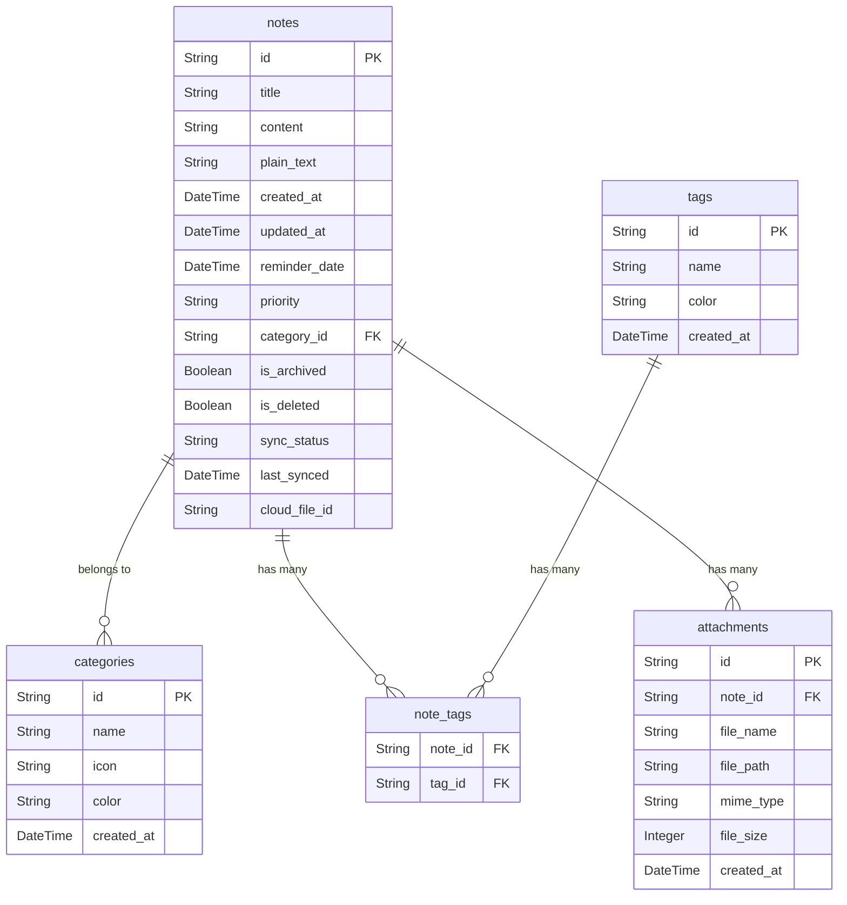

# Design and Architecture

This document outlines the design and architecture of the Note-Taking App.

## Project Overview

A feature-rich, cross-platform note-taking application built with Flutter and backed by a local SQLite database. The app is designed to be robust, scalable, and maintainable, with a focus on providing a seamless user experience.

## Architecture

The application follows a clean architecture pattern, separating concerns into three main layers:

*   **Data Layer:** Responsible for data persistence and retrieval. It includes the local SQLite database and repositories that abstract the data sources.
*   **Domain Layer:** Contains the core business logic and entities of the application. It is independent of the other layers.
*   **Presentation Layer (UI):** The user interface of the application, built with Flutter and managed using the Riverpod state management library.

### Technology Stack

*   **Frontend:** Flutter
*   **State Management:** Riverpod
*   **Database:** SQLite (via `sqflite` package)
*   **Architecture:** Clean Architecture

## Data Model

The application uses a relational database schema to store notes, categories, tags, and other related data.

## Key Decisions

*   **State Management:** Riverpod was chosen for its compile-safe and declarative nature, which simplifies state management and dependency injection.
*   **Database:** A local SQLite database was selected to ensure data is available offline and to provide a fast and reliable storage solution.
*   **Architecture:** A clean architecture approach was adopted to promote separation of concerns, testability, and maintainability.

## Roadmap

*   **Phase 1: Core Functionality (In Progress)**
    *   [x] Basic note creation, editing, and deletion.
    *   [x] Database setup and integration.
    *   [ ] UI implementation for the main screen and note editor.
*   **Phase 2: Advanced Features**
    *   [ ] Tagging and categorization of notes.
    *   [ ] Search functionality.
    *   [ ] Reminders and notifications.
*   **Phase 3: Cloud Sync**
    *   [ ] Integration with a cloud storage provider (e.g., Google Drive, Dropbox).
    *   [ ] Syncing of notes and attachments across devices.